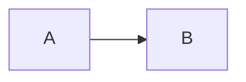

# inlineMark テストドキュメント

このファイルは「対応/非対応ブロックの表示確認」を目的に刷新しています。

## 基本段落

通常の段落に **太字** と *斜体* と `インラインコード` を含みます。
複合フォーマット: **太字の中に *ネストされた斜体* を含む**。

## 見出し

### 見出し3
#### 見出し4
##### 見出し5
###### 見出し6

## 箇条書き

- **太字の項目**
- *斜体の項目*
- `コードの項目`
- [リンク](https://example.com) を含む項目

## 番号付きリスト

1. 最初の項目
2. **太字の番号付き項目**
3. *斜体の番号付き項目*
4. `コードの番号付き項目`
5. [リンク](https://example.com) を含む項目

## コードブロック

```javascript:hello.js
console.log('こんにちは、世界！');
const x = 42;
```

```python:main.py
def hello():
    print("こんにちは、世界！")
```

```txt
plain text block
```

## 引用

> これは引用ブロックです。  
> 複数行にまたがります。

## 画像


## テーブル

| 名前   | 年齢 | 職業        |
| ------ | ---: | :---------: |
| 田中太郎 | 30  | エンジニア  |
| 鈴木花子 | 25  | デザイナー  |
| 佐藤次郎 | 35  | マネージャー |

## 水平線

---

区切りの間のテキスト。

---

## HTML（HTMLブロックの確認）

<div class="note">
  <strong>HTMLブロック</strong> の表示確認。
</div>

## RAW 表示での非対応ブロック確認

:::raw
:::note
これは非対応の admonition 形式（RAW 表示確認用）
:::

<details>
  <summary>details / summary</summary>
  <p>HTML details の中身</p>
</details>



:::

## ドキュメント終了
